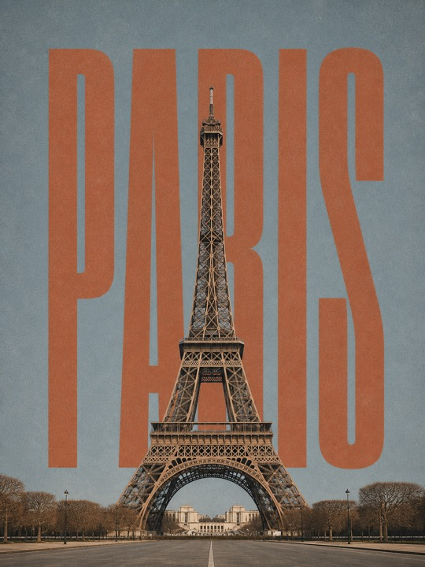
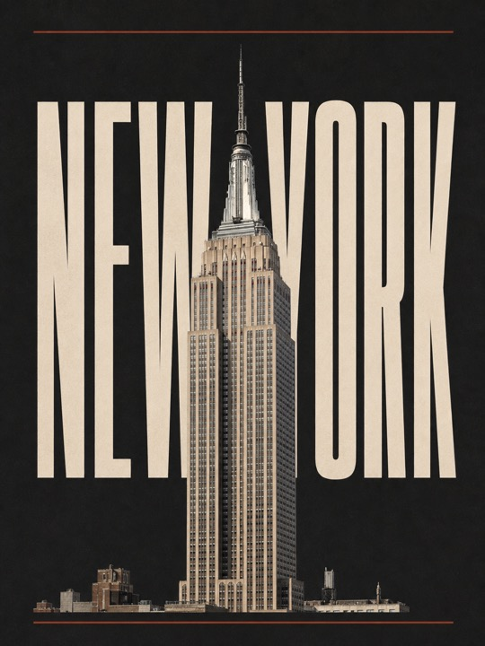
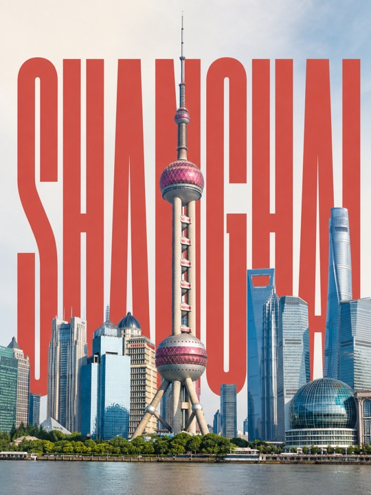
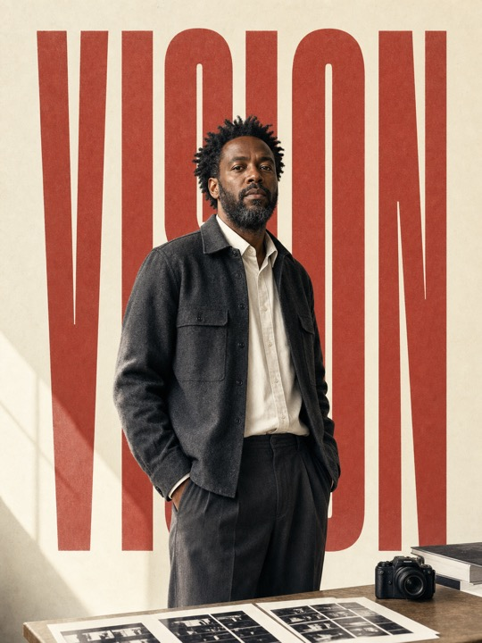
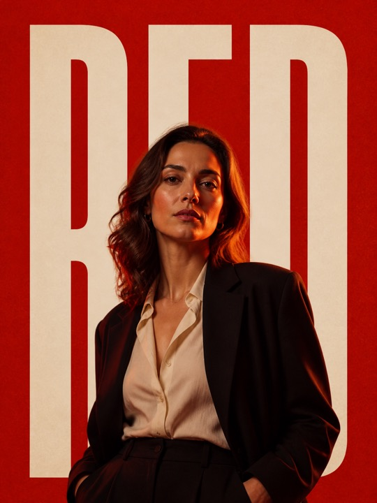

# Editorial Poster Skill

A Codex skill for creating restrained editorial poster images that combine:

- photorealistic landmarks, real scenes, interiors, or people
- monumental ultra-condensed background typography
- warm ivory paper
- muted brick/cinnabar red
- restrained editorial composition
- simple foregrounds and clear subject hierarchy

This skill is designed for stable image direction, not for one-off prompt luck. It can be invoked in English, Chinese, or other languages; the visual grammar remains the same.

## What it does

The skill helps an AI agent generate poster-style images with a consistent visual system:

- city landmark posters
- real street / interior posters
- environmental portrait posters
- Xiaohongshu-style vertical covers
- editorial travel or culture visuals

It includes rules for:

- hero word safe margins
- subject scale
- long-word typography handling
- simple foreground control
- person-vs-place composition
- text reliability and deterministic overlay fallback
- QA rejection criteria
- multilingual prompting and deterministic text overlay fallback
- optional user-specified background colors and restrained palette pairing

## Example outputs

These samples show the range the skill is designed to control: landmark posters, environmental portraits, custom palettes, and high-impact editorial color systems.

| Landmark / dusty palette | Landmark / charcoal palette |
|---|---|
|  |  |

| Landmark / classic city poster | Portrait / warm editorial |
|---|---|
|  |  |

| Portrait / cool editorial | Portrait / cinematic red |
|---|---|
|  |  |

## Repository structure

```text
editorial-poster-skill-github/
  README.md
  LICENSE
  examples/
    gallery/
    prompts.md
  editorial-poster/
    SKILL.md
    agents/
      openai.yaml
    references/
      style-system.md
      prompt-templates.md
```

## Installation

Copy the `editorial-poster/` folder into your Codex skills directory.

Example:

```bash
cp -R editorial-poster ~/.codex/skills/
```

Then invoke it naturally:

```text
Use editorial-poster to make a 3:4 Paris landmark poster.
Hero word: PARIS.
```

## Recommended usage

For stable results, provide:

- mode: `place` or `person`
- subject / location
- exact hero word
- aspect ratio
- lighting / mood
- background color or palette, if relevant
- prompt language, if relevant
- whether text must be production-perfect

Example:

```text
Use editorial-poster to create a vertical 3:4 poster of the Eiffel Tower in Paris.
Hero word: PARIS.
Sunny natural daylight, keep the original tower and city colors, no vintage grey filter.
Simple foreground, one dominant landmark, safe margins for the hero word.
```

Color example:

```text
Use editorial-poster to create a vertical 3:4 poster of the Eiffel Tower in Paris.
Hero word: PARIS.
Background color: dusty blue-grey.
Use muted terracotta typography, preserve the tower's natural iron color, no neon or glossy gradient.
```

Chinese invocation example:

```text
用 editorial-poster 做一张 3:4 巴黎埃菲尔铁塔海报。
主词：PARIS。
晴天自然光，保留铁塔和城市原本颜色，不要做旧发灰。
前景简单，一个主体，大字左右留安全距离。
```

## Text reliability note

Image models can misspell or distort text, especially in non-Latin scripts or long copy. This skill asks for exact hero words and provides QA rules, but for final publishable typography the most reliable workflow is:

1. Generate the image with clean space and subject overlap.
2. Add the final word deterministically in a layout tool.
3. Validate margins, spelling, and thumbnail readability.

## License

MIT. See `LICENSE`.
